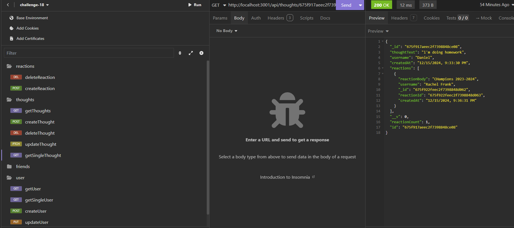

# Social Network API

## Description
This project involves building an API for a social network web application, where users can share their thoughts, react to friends' posts, and create a friend list. The API is designed using Express.js for routing, MongoDB for the database, and Mongoose for object data modeling (ODM). This project provides an understanding of how social networking platforms manage user data, interactions, and connections.

## Motivation
The motivation behind this project is to practice working with full-stack technologies, particularly MongoDB and Express.js, to create a social network backend. Understanding how to structure the database and API to support user interactions like sharing thoughts, reacting to posts, and managing friend lists is a key learning goal.

## Purpose
The purpose of this project is to simulate the backend of a social network application, focusing on building RESTful APIs to allow users to interact with each other, share content, and manage their connections. It also provides an opportunity to work with MongoDB's flexibility in handling unstructured data, making it an ideal choice for social networks.

## Problem Solved
Building a social network API involves managing relationships between users, handling user-generated content (posts, reactions), and structuring data efficiently. This project solves the problem of handling such relationships in a non-relational database (MongoDB) and building the API to support all the necessary features of a social network, including CRUD operations for posts and users, as well as handling reactions and friendships.

## Lessons Learned
Through this project, I gained experience in:
- Setting up a RESTful API using Express.js.
- Structuring MongoDB documents to support user data, posts, reactions, and friendships.
- Managing relationships in MongoDB (e.g., embedding documents for posts and reactions, using references for friendships).
- Utilizing Mongoose for defining models and querying the database.

## Table of Contents
- [Installation](#installation)
- [Usage](#usage)
- [Credits](#credits)
- [License](#license)
- [Features](#features)
- [How to Contribute](#how-to-contribute)
- [Tests](#tests)

## Repository and Video 
- **Code Repository:** [View the code on GitHub](https://github.com/danielsantana9824/18-Social-Network)
- **Code Video:** [View the video on Render](https://app.screencastify.com/v3/watch/bevsVATzO1TENspXyY6C)

## Installation
To set up this project on your local machine, follow these steps:

1. Clone the repository to your local machine:
   ```bash
   git clone https://github.com/danielsantana9824/Social-Network-API.git
   ```
2. Navigate to the project directory:
   ```bash
   cd Social-Network-API
   ```
3. Install the required dependencies:
   ```bash
   npm install
   ```

4. Ensure your MongoDB database is running (either locally or using MongoDB Atlas):
   - For local MongoDB, ensure the service is running:
     ```bash
     mongod
     ```

5. Run the application:
   ```bash
   npm start
   ```

## Usage
Once the application is running, you can interact with the API using a tool like Insomnia or Postman. The main API endpoints are:
- `GET /api/users` - Get all users.
- `GET /api/users/:userId` - Get a specific user by their ID.
- `POST /api/users` - Create a new user.
- `PUT /api/users/:userId` - Update a user's information.
- `DELETE /api/users/:userId` - Delete a user.

- `GET /api/thoughts` - Get all thoughts.
- `GET /api/thoughts/:thoughtId` - Get a specific thought by ID.
- `POST /api/thoughts` - Create a new thought.
- `PUT /api/thoughts/:thoughtId` - Update a thought.
- `DELETE /api/thoughts/:thoughtId` - Delete a thought.

- `POST /api/users/:userId/friends/:friendId` - Add a friend.
- `DELETE /api/users/:userId/friends/:friendId` - Remove a friend.

### Example Screenshot


## Credits
If you collaborated with others, please list their names and provide links to their GitHub profiles here.

## License
This project is licensed under the MIT License. For more information about licenses, please refer to [Choose a License](https://choosealicense.com/).

## Features
- Provides a robust API for social network functionalities.
- Supports CRUD operations for users, thoughts, and reactions.
- Allows users to add and remove friends.

## How to Contribute
If you would like to contribute to this project, please fork the repository and submit pull requests. Ensure that you adhere to coding standards and provide meaningful descriptions for your changes.

Refer to the [Contributor Covenant](https://www.contributor-covenant.org/) for contribution guidelines.

## Tests
To run tests for this application, ensure that you have set up a testing environment. Add instructions on how to run the tests here:
```bash
npm run test
```
